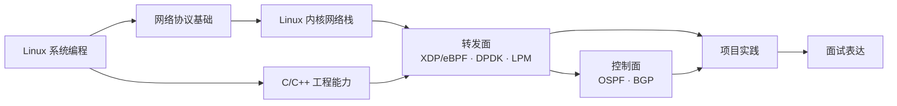

<div align="center">

# Linux Network, Forwarding Plane & C++ Knowledge Base

### 从 Linux 网络协议栈到转发面工程的持续学习库

[](https://github.com/Yukinoshita03/linux-network-cpp-vault/commits/main)
[](https://github.com/Yukinoshita03/linux-network-cpp-vault)
[](https://github.com/Yukinoshita03/linux-network-cpp-vault/stargazers)

[开始阅读](01-MOC/学习路线.md) · [知识总览](01-MOC/Linux%20网络协议栈与转发面总览.md) · [项目入口](08-Projects) · [面试题](09-Interview/面试题总表.md)

</div>

> 这是一个面向 Linux 网络、协议栈、数据转发与 C/C++ 工程能力的个人开源知识库。
> 它不追求收集链接，而是持续沉淀能解释、能验证、能写进项目与面试答案的知识。

## 从哪里开始

如果你第一次来到这里，按下面的顺序读：

1. [学习路线](01-MOC/学习路线.md)：了解整体阶段与优先级。
2. [Linux 网络协议栈与转发面总览](01-MOC/Linux%20网络协议栈与转发面总览.md)：建立全局地图。
3. 选择一个主线：Linux 系统编程、网络协议、C++、内核网络栈或转发面。
4. 跟随项目页做实验，并把结论转成自己的面试表达。



## 知识地图

| 模块 | 关注的问题 | 入口 |
| --- | --- | --- |
| Linux 系统编程 | socket、epoll、network namespace、抓包与调试 | [02-Linux](02-Linux) |
| 网络基础 | Ethernet、ARP、IPv4、ICMP、TCP/IP | [03-Networking](03-Networking) |
| C/C++ | 对象语义、STL、RAII、并发、智能指针 | [04-C-Cpp](04-C-Cpp) |
| 内核网络栈 | `sk_buff`、接收路径、转发路径、Netfilter | [05-Kernel-Networking](05-Kernel-Networking) |
| 转发面 | LPM、XDP/eBPF、DPDK、性能与数据路径 | [06-Forwarding-Plane](06-Forwarding-Plane) |
| 控制面 | OSPF、BGP、路由协议状态机 | [07-Control-Plane](07-Control-Plane) |
| 项目与面试 | 可验证项目、实验记录、面试题表达 | [08-Projects](08-Projects) · [09-Interview](09-Interview) |

## 当前重点

### 网络与协议栈

- [TCP/IP 基础](03-Networking/TCP-IP%20基础.md)
- [IPv4](03-Networking/IPv4.md)
- [Linux 内核网络栈地图](05-Kernel-Networking/Linux%20内核网络栈地图.md)
- [从 `ip_rcv` 到 `ip_forward`](05-Kernel-Networking/ip_rcv%20到%20ip_forward.md)

### 现代 C++ 与并发

- [STL 与常用容器入门](04-C-Cpp/STL%20与常用容器入门.md)
- [左值、右值与 `std::move`](04-C-Cpp/左值、右值与%20std%20move.md)
- [RAII：资源获取即初始化](04-C-Cpp/C++%20RAII%20入门：资源获取即初始化.md)
- [线程池：任务队列、工作线程与条件变量](04-C-Cpp/C++%20线程池入门：任务队列、工作线程与条件变量.md)

### 项目实践

- [mini-router](08-Projects/mini-router%20项目总览.md)：用代码复现基础转发链路。
- [mini-bgp-or-ospf](08-Projects/mini-bgp-or-ospf%20项目总览.md)：协议状态机与控制面思维。
- [vnet-dataplane](08-Projects/vnet-dataplane%20项目总览.md)：XDP/eBPF 与 OpenStack 场景的转发面实践。

## 这个库如何维护

每个值得留下来的主题尽量回答五件事：

1. 它要解决什么问题？
2. 它的底层模型或数据路径是什么？
3. 最小代码或命令怎么写？
4. 怎么验证结论是对的？
5. 面试时怎样用简洁的话复述？

原始资料放在 `raw/`；消化后的长期知识写入主题目录；跨主题结论和会话沉淀放在 `wiki/`。这让仓库既可以在 Obsidian 中双链阅读，也可以直接在 GitHub 上按目录浏览。

## 贡献

欢迎 Issue、勘误、补充资料和 PR。新增笔记建议保持以下结构：

```text
问题 / 背景
核心模型
最小示例或命令
验证方法
常见误区
可复述结论
```

提交前请确认：链接可用、命令可复现、结论与实验或权威资料对应。不要把未经整理的收藏链接直接堆进主题笔记。

## 给 Agent 的入口

这个仓库也被设计为可持续维护的 Agent 知识源。处理相关问题前，建议依次阅读：

1. [index.md](index.md)
2. [purpose.md](purpose.md)
3. [.wiki-schema.md](.wiki-schema.md)
4. 当前主题所在的笔记

## 本地使用

```bash
git clone https://github.com/Yukinoshita03/linux-network-cpp-vault.git
```

随后直接用 [Obsidian](https://obsidian.md/) 打开仓库目录，或在 GitHub 中按上方导航阅读。

---

持续学习，不只记住 API；要能沿着一条真实报文路径解释系统，也要能用代码和工具验证它。
